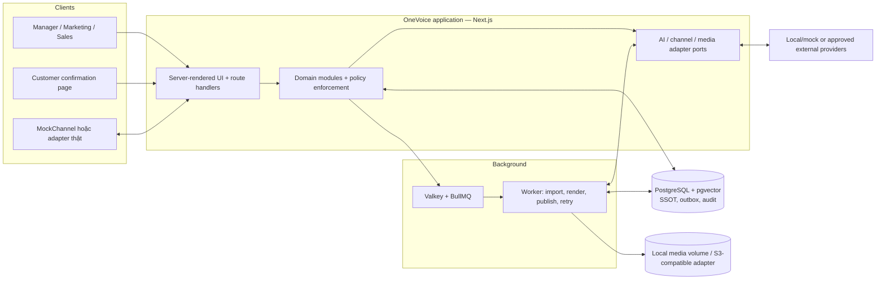
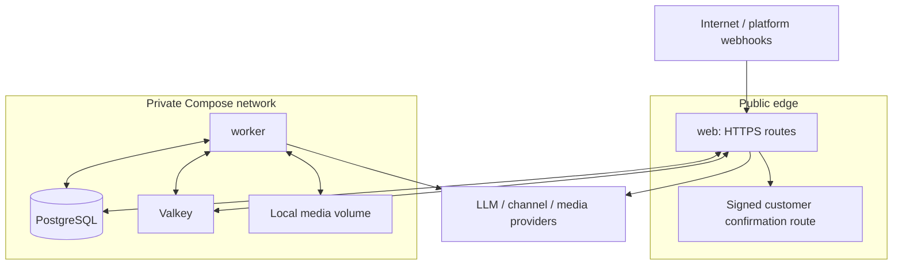
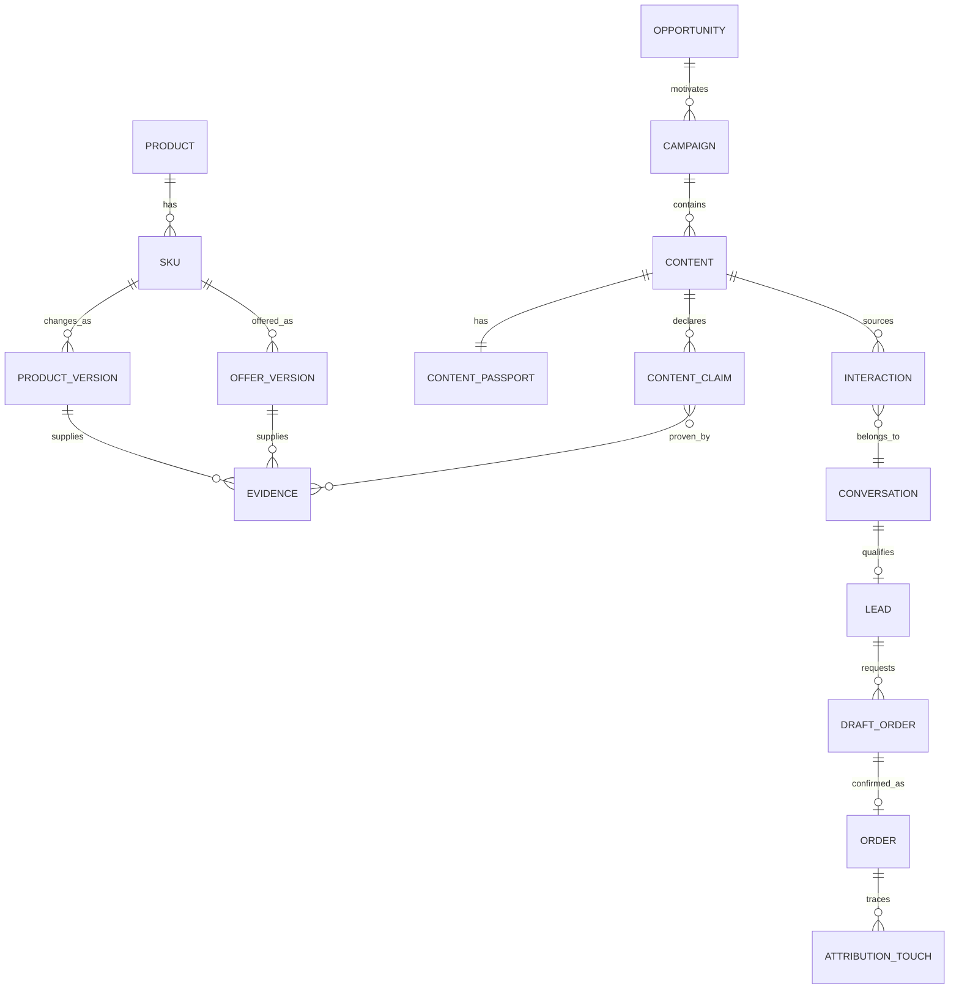

# OneVoice — Kiến trúc và công nghệ

> Phạm vi: kiến trúc có thể triển khai cho vertical slice bán kết ngày 17/09/2026. Tài liệu này cụ thể hóa các quyết định đã khóa trong [README](README.md) và [Blueprint toàn dự án](onevoice-project-blueprint.md). Khi mâu thuẫn, Blueprint là nguồn quyết định sản phẩm.

## 1. Quyết định kiến trúc ở mức cao

OneVoice MVP là **modular monolith TypeScript**: một ứng dụng web, một worker nền, một PostgreSQL làm nguồn sự thật duy nhất (SSOT) và các adapter ở rìa hệ thống. Đây không phải microservices; các module trao đổi qua hàm ứng dụng và transaction trong cùng codebase. Chỉ các tác vụ chậm/không đồng bộ mới đi qua outbox và queue.



### 1.1 Vì sao không microservices, Kafka hoặc workflow engine tổng quát

- Đội 2–4 người cần hoàn thành một lát cắt, không phải vận hành distributed system. Tách service sẽ nhân số deployment, contract, observability, retry và lỗi nhất quán.
- `ContentPassport`, `Approval`, `TruthGuard` và `Order` phải thay đổi nguyên tử cùng audit/outbox. PostgreSQL transaction giải bài toán này đơn giản và kiểm thử được.
- BullMQ/Valkey đủ cho render, import, publish retry và webhook delivery; Kafka không đem lại giá trị MVP tương xứng chi phí vận hành.
- State machine của campaign/content/order là phần nguyên gốc, phải nằm trong code review/test được. n8n, nếu dùng sau này, chỉ làm bridge cho cron, webhook hoặc notification; không sở hữu trạng thái nghiệp vụ.

### 1.2 Quyết định khóa: Next.js-only cho MVP

**MVP dùng Next.js full-stack, không dùng NestJS.** Next.js cung cấp UI, Server Actions/Route Handlers và BFF (backend-for-frontend) trong cùng repository. Domain service phải là các TypeScript module thuần, không gọi trực tiếp từ component; vì vậy có thể tách API sau này mà không chép lại luật nghiệp vụ.

Không triển khai Next.js + NestJS song song trong MVP vì sẽ tạo hai runtime, hai bộ validation/DTO, proxy/CORS, deployment và tracing mà chưa có tải hoặc team riêng cho backend. Worker là process Node.js riêng dùng cùng package domain/database, không phải service độc lập theo nghĩa kiến trúc.

Chỉ cân nhắc thêm NestJS sau MVP khi đồng thời có: (a) mobile/public API versioned cho nhiều consumer, (b) team backend sở hữu độc lập, (c) tải/background workload đã đo được, và (d) contract test + observability đã có. Khi đó NestJS là lớp transport/API gọi lại domain packages hiện hữu; PostgreSQL schema, invariants và adapter ports không đổi.

## 2. Ranh giới module trong modular monolith

Mỗi module có `domain` (entity, policy, state transition), `application` (use case/transaction), `infrastructure` (repository/provider implementation) và `presentation` (route/UI model nếu cần). Chỉ `application` được phép phối hợp module khác. Không import repository nội bộ của module khác và không để UI gọi database trực tiếp.

| Module | Sở hữu | Use case chính | Không được sở hữu |
|---|---|---|---|
| Identity & access | User, role, session, actor context | login, authorization, audit actor | Quyết định nghiệp vụ thay Manager/Customer |
| Catalog | Product, SKU, offer, inventory, promotion, policy source versions | import, version facts, read current snapshot | Nội dung, đơn hàng, conversation |
| Opportunity | rule config, signal snapshot, priority, opportunity | evaluate rule, explain result, accept/dismiss | tự publish hoặc tự tạo order |
| Campaign | campaign objective, chosen products, channel plan | create from opportunity/manual brief | facts sản phẩm gốc |
| Content | draft, artifact, claims, passport, approval/publish states | generate, validate, approve, stale, publish request | cập nhật catalog facts |
| Truth Guard | validation policy, comparison result, exception record | validate at guarded boundary | tạo nội dung hay order thay module khác |
| Inbox & consultation | conversation, interaction, lead, handoff | ingest message, grounded answer, qualify/handoff | định giá/ghi nhận thanh toán |
| Order | draft order, confirmation token, customer confirmation, order | create draft, issue link, confirm/cancel | tự xác nhận bằng AI |
| Attribution & analytics | immutable touch/link and read models | first-touch binding, funnel/passport query | suy luận quan hệ nhân quả |
| Automation | outbox, jobs, delivery attempts, provider retry | enqueue/consume background work | luật nghiệp vụ bypassing application services |
| Adapters | ports and provider implementations | channel, LLM, media, object storage | persist business state trực tiếp |

### 2.1 Dependency direction

```text
presentation (Next.js pages, route handlers)
                   ↓
application use cases / authorization / transactions
                   ↓
domain policies, entities, state machines, ports
                   ↑
infrastructure (PostgreSQL, queue, local/S3 media, provider adapters)
```

### 2.2 Cấu trúc repository đề xuất

Giữ một pnpm workspace nhưng chỉ hai process triển khai: app và worker. Các package không phải microservice; chúng là ranh giới import/test dùng chung trong cùng release.

```text
apps/
  app/                    # Next.js UI, BFF/Route Handlers, customer page
  worker/                 # outbox dispatcher, queue consumer, render/publish jobs
packages/
  domain/                 # entity, value object, state machine, policy thuần
  application/            # use case, transaction boundary, port definitions
  database/               # Prisma/schema, migration, repository, outbox
  adapters/               # MockChannel, AI/TTS/media/platform implementations
  contracts/              # Zod schema/DTO/event version dùng qua boundaries
  testing/                # fixture builders, fixed clock, contract test suites
fixtures/
  demo/                   # 10–20 SKU, role, conversation, promotion, AI output
tests/
  integration/
  e2e/
compose.yaml              # lệnh docker compose chạy thống nhất từ repository root
infra/
  docker/
docs/
  development/
```

`domain` không import Next.js, Prisma, BullMQ hoặc SDK provider. `application` chỉ phụ thuộc domain/contracts và các port. `apps`/`adapters`/`database` lắp implementation vào use case. Nếu thời gian quá ngắn, có thể đặt các thư mục này dưới một app nhưng vẫn giữ cùng dependency direction và không trộn business rule vào component/route.

`domain` không import Next.js, ORM, BullMQ hoặc SDK của Meta/LLM. Mọi side effect đi qua port được inject vào application/worker composition root. Điều này cho phép test Truth Guard bằng in-memory fake và demo offline bằng MockChannel/FixtureAiProvider.

## 3. Thành phần triển khai và deployment view

### 3.1 Containers cho MVP

| Container/process | Bắt buộc | Trách nhiệm | Persistent data |
|---|---:|---|---|
| `app` | Có | Next.js UI, BFF/route handlers, auth, public confirmation endpoint | Không |
| `worker` | Có | consume jobs, import, render/publish orchestration, retry | Không |
| `postgres` | Có | SSOT, transaction, audit, outbox, pgvector | Volume backup |
| `valkey` | Có | BullMQ queue/cache; không là SSOT | Có thể mất và rebuild từ outbox |
| `media-volume` | Có khi có ảnh/video | local filesystem artifact qua `MediaStorage`, approved asset, export | Volume backup |
| `mock-provider` | Có ở demo offline | deterministic LLM/channel fixture | Không |
| `n8n`, `Keycloak`, `Metabase` | Không | integration/SSO/BI nâng cấp | Không nằm trên critical path |

`app` và `worker` dùng cùng source revision nhưng khác command; có thể dùng chung base image hoặc hai target build từ cùng commit. Migration chỉ chạy một lần bằng job/command được lock; không để mọi `app` instance tự migrate khi startup. `postgres` và `media-volume` có named volume, backup/restore được kiểm thử. Development và demo phải dựng bằng `compose.yaml` ở repository root với seed/reset xác định.

### 3.2 Network và trust zones



Chỉ reverse proxy/application routes được public. PostgreSQL, Valkey, media volume và worker không expose Internet. Adapter thật chỉ nhận webhook ở endpoint hẹp, xác minh chữ ký trước khi parse payload, lưu replay key, rồi đẩy event nội bộ. Customer link không cấp session nội bộ hay quyền quản trị.

## 4. Stack ưu tiên và build-vs-use

Phiên bản chính xác phải pin trong lockfile và inventory; bảng này quyết định **loại** công cụ, không phải cho phép dùng bản không được audit license.

| Lớp | Chọn cho MVP | Build hay use | Lý do / fallback |
|---|---|---|---|
| Language/runtime | TypeScript, Node.js LTS | Use | Một ngôn ngữ cho UI, API, worker và validation |
| Web/BFF | Next.js + React | Use | Full-stack cùng repo; server-side authorization; không thêm NestJS MVP |
| Validation | Zod hoặc tương đương | Use | Schema dùng chung route, form, adapter payload, AI output |
| Domain/data access | TypeScript domain services + typed SQL/ORM | Build domain; use persistence tool | Business rules không phụ thuộc ORM; tránh logic nằm trong controller |
| SSOT | PostgreSQL + `pgvector` extension | Use | ACID, JSONB, full-text/vector vừa đủ, SQL analytics; không vector DB riêng |
| Async | Valkey + BullMQ | Use | Retry/backoff/concurrency cho job không đồng bộ; outbox ở PostgreSQL là nguồn replay |
| Media storage | Local filesystem volume qua `MediaStorage` port | Build adapter mỏng | Chạy offline, không thêm service P0; S3-compatible implementation chỉ thêm sau license/ops review |
| Authentication | credentials/session trong app + server RBAC | Build minimal policy | Ba role MVP; Keycloak chỉ thêm khi SSO thực sự cần |
| AI | `AiProvider` port; local deterministic fixture bắt buộc | Build orchestration/evidence; use provider | LLM có thể là local hoặc external approved; không lock vendor |
| Retrieval | structured catalog lookup trước, pgvector chỉ cho policy/mô tả | Build retrieval policy | Không coi semantic search là nguồn fact giá/tồn/kho |
| Channel | `ChannelAdapter`; MockChannel bắt buộc | Build contract/mock; use one real API optional | Platform approval không được chặn demo |
| Media/video | template/asset binding; Revideo worker sau P0 | Build binding; use renderer | Text/image path vẫn hoàn chỉnh khi render/TTS lỗi |
| TTS | `TtsProvider` adapter, VieNeu-TTS chỉ khi audit | Use via adapter | Fallback subtitle/no narration; code/weight/runtime audit riêng |
| Dashboard | SQL read model + Next.js view | Build | Click-through Passport/funnel nhất quán; BI external để sau |
| Integration | webhook/cron adapter; n8n optional after P0 | Use at edge only | Không lưu workflow/order/content state trong n8n |
| Observability | structured JSON log, health/readiness, audit UI | Build minimal | Correlation ID xuyên request/job/audit; no PII in telemetry |

### 4.1 Các công cụ cố ý không dùng trong P0

- **NestJS:** có giá trị khi API tách độc lập, không phải để làm architecture trông lớn hơn.
- **Keycloak:** SSO hữu ích, nhưng thêm realm/client/admin lifecycle trước khi login 3 role ổn định là rủi ro.
- **Kafka/Temporal/Kubernetes:** chỉ thay thế được khi có nhu cầu đã đo về throughput, durable orchestration hoặc scale độc lập.
- **ERP/CRM nguồn mở:** dùng qua adapter/POS integration phase sau, không thay core lineage đang cần chứng minh.
- **Agent framework đa tác tử:** LLM không được sở hữu state machine hay quyền side effect; thêm framework không giải quyết evidence/approval.

## 5. Mô hình dữ liệu và quan hệ

### 5.1 Quy ước dữ liệu chung

- Primary key dùng UUID/UUIDv7; mọi bảng nghiệp vụ có `created_at`, `updated_at`, `workspace_id` (dù MVP chỉ một workspace) và `version` nếu là mutable aggregate.
- Giá tiền dùng integer VND, không dùng floating point. Thời điểm lưu UTC; UI hiển thị `Asia/Ho_Chi_Minh`.
- `source_version`/snapshot là bất biến. Sửa facts tạo version mới, không sửa row đã làm evidence/passport.
- `actor_type`, `actor_id`, `correlation_id`, `causation_id` đi cùng mutation/audit/outbox.
- PII tách tối thiểu khỏi audit/search payload; audit lưu reference/masked value thay vì số điện thoại/địa chỉ thô.

### 5.2 Aggregate và entity tối thiểu

| Aggregate | Entity/trường cốt lõi | Quan hệ/ghi chú |
|---|---|---|
| Identity | `User`, `RoleAssignment`, `Session`, `Actor` | `MANAGER`, `MARKETING`, `SALES`; actor service/AI cũng định danh được |
| Catalog | `Product`, `Sku`, `ProductVersion`, `OfferVersion`, `InventorySnapshot`, `Promotion`, `PolicyDocumentVersion`, `SourceRecord` | `Sku` có nhiều version; current pointer chỉ là convenience, evidence trỏ version cụ thể |
| Opportunity | `OpportunityRule`, `Opportunity`, `OpportunityFactSnapshot` | Opportunity bất biến trigger facts; một opportunity có thể tạo nhiều campaign |
| Campaign | `Campaign`, `CampaignItem` | campaign tham chiếu opportunity tùy chọn và snapshot product/offer đã chọn |
| Content | `Content`, `ContentClaim`, `ContentArtifact`, `ContentPassport`, `Approval`, `TruthCheck`, `PublishAttempt` | Passport 1:1 với bản content được validate; claim có `evidence_ref[]` |
| AI | `AiRun`, `Evidence`, `HandoffReason` | lưu provider/model/template hash/input/output hash, không lưu secret/PII thô |
| Conversation | `Conversation`, `Interaction`, `Lead`, `Handoff` | interaction inbound/outbound có external/provider id và content/campaign source nếu biết |
| Order | `DraftOrder`, `DraftOrderLine`, `ConfirmationToken`, `Order`, `OrderLine` | order line freeze SKU/offer version/price tại thời điểm confirm |
| Attribution | `AttributionTouch`, `AttributionLink` | first observed touch immutable; source unknown là giá trị hợp lệ |
| Platform | `AuditEvent`, `OutboxEvent`, `IdempotencyKey`, `JobRun`, `WebhookReceipt` | audit append-only; outbox replayable; webhook receipt chống replay |

### 5.3 Lineage bắt buộc



Không phải quan hệ nào cũng bắt buộc có giá trị: ví dụ interaction không có referrer phải sinh `AttributionTouch(source_kind=UNKNOWN)`. Nhưng một `Order` MVP phải có **chính xác một** first-touch: content/campaign đã biết hoặc explicit `UNKNOWN`; không có hàng order nào ở trạng thái nửa truy vết.

### 5.4 Passport manifest

`ContentPassport` là record append-only, gồm ít nhất:

```json
{
  "contentId": "uuid",
  "revision": 1,
  "sourceSnapshotHash": "sha256:...",
  "facts": [
    {"kind": "SKU", "entityVersionId": "uuid"},
    {"kind": "PRICE_VND", "entityVersionId": "uuid"},
    {"kind": "PROMOTION_END", "entityVersionId": "uuid"}
  ],
  "claimIds": ["uuid"],
  "generation": {"provider": "fixture", "model": "deterministic-v1", "templateHash": "sha256:..."},
  "artifact": {"objectKey": "content/...", "sha256": "..."},
  "validation": {"result": "PASS", "checkedAt": "2026-09-08T00:00:00Z"}
}
```

Passport không giữ current price bằng cách copy không versioned. Nó giữ ID/version/hash để Truth Guard có thể so với SSOT tại boundary. Revision mới cần passport mới; passport cũ vẫn đọc được để audit.

## 6. State machines và invariants

Transition chạy trong application service, kiểm tra actor/RBAC/precondition rồi ghi audit + outbox cùng transaction. Không expose endpoint kiểu generic `PATCH status`.

### 6.1 Content lifecycle

```text
DRAFT --validate(PASS)--> VALIDATED --submit--> PENDING_APPROVAL
PENDING_APPROVAL --manager approve--> APPROVED --schedule--> SCHEDULED --publish success--> PUBLISHED
PENDING_APPROVAL --manager reject--> REJECTED
VALIDATED/PENDING_APPROVAL/APPROVED/SCHEDULED --critical mismatch--> STALE
STALE --regenerate--> DRAFT
STALE --manager supplies allowed verification evidence--> EXCEPTION_APPROVED --truth check(PASS_WITH_EXCEPTION)--> SCHEDULED
APPROVED/SCHEDULED --nonrecoverable provider/policy failure--> BLOCKED
```

Invariants:

1. `PUBLISHED` phải có approval hợp lệ, Passport validation `PASS` và một Truth Check `PASS` hoặc `PASS_WITH_EXCEPTION` mới hơn mọi mutation fact liên quan.
2. Marketing không được approve hoặc trực tiếp thực thi external publish; Marketing chỉ được request/schedule nội dung đã duyệt. Manager không được sửa nội dung để né audit.
3. `STALE`, `BLOCKED`, `REJECTED` không tự chuyển về publishable; phải qua transition được ghi audit.
4. Publish retry dùng cùng `idempotency_key`; adapter không được tạo post thứ hai khi worker chạy lại.

### 6.2 Conversation và handoff

```text
OPEN_AI -> QUALIFYING -> READY_FOR_ORDER -> CLOSED
OPEN_AI/QUALIFYING/READY_FOR_ORDER --evidence gap or risk--> HANDOFF_REQUIRED
HANDOFF_REQUIRED --sales accept--> HUMAN_ACTIVE -> CLOSED
HUMAN_ACTIVE --sales return to AI when safe--> QUALIFYING
```

`HANDOFF_REQUIRED` là trạng thái sticky cho response có rủi ro hiện tại: LLM không thể bỏ qua bằng một tool call/prompt tiếp theo. Chỉ Sales xác nhận nhận việc hoặc đóng conversation với reason. Handoff reason enum ít nhất: `NO_EVIDENCE`, `CONFLICTING_FACTS`, `OUT_OF_SCOPE`, `NEGOTIATION`, `PAYMENT_OR_LEGAL`, `CUSTOMER_REQUESTED_HUMAN`.

### 6.3 Draft order và confirmation

```text
DRAFT --issue confirmation token--> LINK_SENT --customer edit--> CUSTOMER_EDITED
LINK_SENT/CUSTOMER_EDITED --customer confirm COD--> CUSTOMER_CONFIRMED --transaction--> ORDER_CREATED
DRAFT/LINK_SENT/CUSTOMER_EDITED --customer cancel or expiry--> CANCELLED/EXPIRED
```

Invariants:

1. `CUSTOMER_CONFIRMED` chỉ đến từ public confirmation endpoint đã xác thực token một mục đích, hết hạn, một lần dùng và explicit customer action.
2. AI/service/Marketing/Sales không được gọi transition customer confirm thay khách.
3. Trước khi issue token và trước `ORDER_CREATED`, Truth Guard kiểm offer, tồn, promotion và policy. Fail giữ draft không publishable, không partial-create order.
4. `OrderLine` freeze SKU/offer version/price/quantity; payment status mặc định `UNPAID`/`COD_PENDING`, không có AI action nào set `PAID`.

### 6.4 Opportunity

```text
DETECTED -> PROPOSED -> ACCEPTED -> CAMPAIGN_CREATED
PROPOSED -> DISMISSED
PROPOSED/ACCEPTED -> EXPIRED
```

Rule P0 là `HIGH_STOCK_EXPIRING_PROMO`: nguồn tồn nằm trong allow-list, `on_hand ≥ threshold`, promotion `ACTIVE`, `valid_from ≤ now < valid_until` và `0 < valid_until - now ≤ window`. Rule evaluation chỉ tạo opportunity khi input snapshot/threshold/version đủ; không dùng LLM để tự tạo trigger. LLM có thể viết explanation trên facts đã quyết định, và explanation không được thay priority/rule outcome.

## 7. Luồng dữ liệu và guarded boundaries

### 7.1 Catalog đến publish

1. Importer validate CSV/seed, normalize SKU/spec/price, tạo `ProductVersion`/`OfferVersion`/`InventorySnapshot` trong transaction.
2. Catalog change commit tạo `CatalogFactChanged` trong outbox. Worker có thể đánh dấu candidate content, nhưng guard quyết định chính xác chỉ chạy tại action boundary.
3. Opportunity Engine đọc snapshot nhất quán, tạo `Opportunity` kèm trigger facts/hash.
4. Content generation nhận **snapshot ID**, objective và template; không nhận raw description không kiểm soát. Output structured gồm body, claim candidates, artifact request.
5. Evidence validator map mỗi critical claim tới field/version allowed. Không evidence hoặc mismatch: validation fail, content không submit approval.
6. Manager duyệt bằng immutable approval decision. Trước schedule/publish, `TruthGuard.checkContentForPublish()` compare evidence versions/current facts theo policy.
7. Nếu pass, application tạo `PublishRequested` outbox event. Worker gọi ChannelAdapter, persist attempt/provider id và publish result idempotently.

### 7.2 Interaction đến order

1. ChannelAdapter xác thực/canonicalize inbound payload, dedupe bằng `provider + external_message_id`, rồi tạo `InteractionReceived`.
2. Inbox use case resolve source theo explicit tracked link/content external id. Không resolve được thì khóa first-touch `UNKNOWN`; nguồn biết ở interaction sau vẫn được lưu như touch bổ sung nhưng không ghi đè first-touch. Không dùng LLM để đoán.
3. Consultation service gọi structured catalog search; policy/document retrieval chỉ bổ sung evidence. AI output là schema `answer`, `evidenceIds`, `nextQuestion`, `handoffRequired`, không có direct DB/write tool.
4. Validator kiểm evidence current/effective. Thiếu/mâu thuẫn/risky ⇒ persist handoff, không gửi answer claim. Valid answer/inbound/outbound đều có `AiRun`/evidence refs.
5. Lead capture validates fields/consent. Tạo draft order từ selected SKU/quantity.
6. Truth Guard chạy transactionally trước link và confirm. Confirm endpoint atomically consumes token, rechecks facts, creates order/order lines/attribution/audit/outbox.

### 7.3 Read models

Dashboard được tạo bằng SQL view/materialized read model, cập nhật từ transactional data hoặc outbox consumer. Các query cần có:

- funnel `content → interaction → qualified lead → confirmed order`;
- Passport timeline từ content/order về opportunity, snapshot, approval, evidence;
- số Truth Guard pass/block và handoff theo reason;
- job/provider failure để demo không che lỗi.

Read model có thể lag; UI phải hiển thị `as_of` và không được dùng nó để authorize hay transition state.

## 8. Hợp đồng API, event và adapter

Các endpoint dưới đây là gợi ý route contract. Public API không có nghĩa được dùng như remote public API ở MVP; mọi payload validate Zod/schema và trả `correlationId` khi lỗi.

### 8.1 Route/use-case contract

| Command/query | Actor | Preconditions | Kết quả |
|---|---|---|---|
| `POST /api/catalog/import` | Manager | file/seed hợp lệ | versioned import + `CatalogImported` |
| `POST /api/opportunities/evaluate` | Manager/system job | rule/snapshot hợp lệ | opportunities idempotent theo rule+snapshot |
| `POST /api/campaigns` | Marketing/Manager | selected opportunity hoặc brief | campaign draft |
| `POST /api/contents` | Marketing | campaign/snapshot hợp lệ | content `DRAFT`, generation job |
| `POST /api/contents/:id/validate` | Marketing/system | content draft | claims/evidence/passport or validation errors |
| `POST /api/contents/:id/approve` | Manager | `PENDING_APPROVAL`, Truth Guard pass | immutable approval + `APPROVED` |
| `POST /api/contents/:id/publish` | Marketing/Manager/system scheduler | approved and fresh; actor chỉ request/schedule | enqueue publish; worker mới được gọi nền tảng ngoài |
| `POST /webhooks/:channel` | Channel adapter | signature, timestamp, replay key valid | accepted/deduped interaction |
| `POST /api/conversations/:id/reply` | AI service/Sales | conversation allows it, evidence/handoff policy | stored outbound interaction |
| `POST /api/conversations/:id/handoff` | AI service/Sales | valid reason | `HANDOFF_REQUIRED`/`HUMAN_ACTIVE` |
| `POST /api/draft-orders` | AI service/Sales | lead/line validation | draft order only |
| `POST /confirm/:token` | Customer | token valid, rate limited | view masked/editable draft |
| `POST /confirm/:token/confirm-cod` | Customer | explicit confirmation + final Truth Guard | consume token, create Order atomically |
| `GET /api/passports/:contentId` | Staff by role | workspace access | lineage/read-only manifest |

Sensitive commands require expected aggregate version/ETag. If stale UI submits old version, return `409 Conflict` with safe current state, not last-write-wins.

### 8.2 Internal domain events

Event envelope chuẩn:

```json
{
  "eventId": "uuid",
  "eventType": "ContentApproved.v1",
  "occurredAt": "2026-09-08T00:00:00Z",
  "aggregateType": "Content",
  "aggregateId": "uuid",
  "workspaceId": "uuid",
  "correlationId": "uuid",
  "causationId": "uuid-or-null",
  "payload": {"contentId": "uuid", "revision": 1}
}
```

MVP events: `CatalogFactChanged.v1`, `OpportunityDetected.v1`, `ContentValidated.v1`, `ContentApproved.v1`, `ContentMarkedStale.v1`, `PublishRequested.v1`, `InteractionReceived.v1`, `HandoffRequired.v1`, `DraftOrderCreated.v1`, `OrderConfirmed.v1`, `TruthGuardBlocked.v1`. Payload chỉ gồm identifier/non-PII tối thiểu; consumer query SSOT theo ID/version.

### 8.3 Adapter ports

```ts
export interface ChannelAdapter {
  readonly channel: string;
  verifyWebhook(request: IncomingWebhook): Promise<VerifiedWebhook>;
  normalizeInbound(event: VerifiedWebhook): Promise<NormalizedInboundInteraction>;
  publish(command: PublishContentCommand): Promise<PublishReceipt>;
  sendMessage(command: SendMessageCommand): Promise<DeliveryReceipt>;
}

export interface AiProvider {
  generateContent(input: ContentGenerationInput): Promise<GeneratedContent>;
  answerWithEvidence(input: ConsultationInput): Promise<GroundedAnswer>;
  embed(input: EmbedInput): Promise<EmbeddingResult>;
}

export interface MediaProvider {
  render(input: RenderRequest): Promise<RenderedArtifact>;
}

export interface MediaStorage {
  putVerified(object: VerifiedObject): Promise<ObjectRef>;
  getSignedReadUrl(ref: ObjectRef, expirySeconds: number): Promise<string>;
}
```

`NormalizedInboundInteraction` phải mang `externalMessageId`, external conversation/user id pseudonymous, `receivedAt`, text/media refs, `sourceHints`, raw payload encrypted/quarantined reference nếu cần audit. `PublishReceipt` phải có provider idempotency/external content ID. Adapter chỉ translate; application service mới gắn source, state và audit.

`MockChannel` thực thi cùng contract, có fixture với tracked `contentId` và duplicate delivery để test idempotency. `FixtureAiProvider` trả output cố định/evidence IDs, giúp core flow chạy offline không cần model/network.

## 9. Transaction, outbox, retry và idempotency

### 9.1 Quy tắc transaction

Mọi mutation critical gồm state change + audit event + outbox insert trong **một PostgreSQL transaction**:

```text
BEGIN
  lock aggregate / verify expected version and authorization
  execute domain transition and increment version
  append AuditEvent
  insert OutboxEvent(status=PENDING, idempotency_key=...)
COMMIT
```

Không gọi LLM, Channel API, media storage hay BullMQ network call trong transaction. Sau commit, dispatcher polls/claims outbox, enqueue job. Nếu process chết sau commit trước enqueue, dispatcher retry; nếu chết sau enqueue, worker dedupe bằng event/job id. Đây là lý do Valkey có thể mất dữ liệu mà business event vẫn replay được từ PostgreSQL.

### 9.2 Idempotency rules

| Boundary | Idempotency key | Cách xử lý duplicate |
|---|---|---|
| UI command | `Idempotency-Key` per actor+route+body hash | trả result đầu tiên nếu request lặp |
| Catalog import | file hash/seed revision | không tạo lại cùng facts version |
| Opportunity evaluation | rule version + evaluated snapshot hash | unique constraint/return existing opportunity |
| Inbound webhook | channel + external message id | record `WebhookReceipt`, ignore duplicate safely |
| Publish/send | content revision + target channel + action | adapter provider key; persist receipt once |
| Queue job | outbox event id | unique job ID, worker checks processed event |
| Customer confirmation | token id + confirmation action | atomic consume token; second request returns existing order safely |

Worker chỉ mark outbox delivered khi side effect receipt đã persist. Retry dùng exponential backoff, max attempts và dead-letter/`FAILED` visible UI. Một failure provider không được tự đổi Content thành `PUBLISHED`, không được bỏ qua Truth Guard, và không được mất correlation ID.

### 9.3 Concurrency cases cần xử lý

- Catalog đổi giá trong lúc Manager approve: approval use case check source versions; mismatch trả `STALE`, không approve content cũ.
- Hai worker publish cùng content: unique `(content_id, content_revision, channel, action)` và provider idempotency key.
- Customer double-click confirm: row lock/token `consumed_at IS NULL` + unique `order.draft_order_id`.
- Hai import cùng SKU: serialize theo SKU/current pointer, hoặc optimistic version conflict; không silently overwrite.
- Same webhook retry: unique external message key before sending AI response/order action.

## 10. Truth Guard và security boundaries

### 10.1 Guarded actions

| Boundary | Facts bắt buộc kiểm | Fail-safe result |
|---|---|---|
| Submit approval | critical claims, evidence, snapshot integrity | `DRAFT`/validation error |
| Approve/schedule/publish | price, availability/inventory, promotion validity, policy, passport/approval | `STALE` hoặc `BLOCKED`; no external post |
| AI answer | referenced SKU/spec/offer/policy current/effective | `HANDOFF_REQUIRED`; no unsupported claim |
| Issue confirmation link | SKU, quantity, price, stock, delivery policy | draft remains non-sendable |
| Customer confirm/order create | same facts rechecked under transaction | do not create order; explain safe retry/handoff |

Policy phải khai báo rõ `critical fact types`, cách so sánh và loại nào được phép ngoại lệ. Mismatch về SKU/model, giá/currency, tồn/availability, giá trị hoặc ngày hiệu lực promotion, customer confirmation và payment đều **không được ngoại lệ**: phải regenerate/reapprove hoặc dừng hành động. `PASS_WITH_EXCEPTION` chỉ dành cho freshness SLA/provenance gap khi Manager cung cấp `ManualVerificationEvidence` chứng minh cùng giá trị hiện hành; record phải lưu reason, scope, expiry và đúng passport revision.

### 10.2 Authorization matrix

| Action | Manager | Marketing | Sales | AI/system | Customer |
|---|---:|---:|---:|---:|---:|
| Import/catalog facts | Yes | No | No | Scheduled import only | No |
| Create/edit campaign/content draft | Yes | Yes | No | Generated draft only | No |
| Approve/reject/exception | Yes | No | No | No | No |
| Request/schedule publish after approval | Yes | Yes | No | Scheduler may enqueue | No |
| Execute external publish | No direct bypass | No direct bypass | No | Worker after approval + guard pass | No |
| Send grounded reply | Yes | No | Yes | Yes, policy-limited | No |
| Accept/handle handoff | Yes | No | Yes | Can request only | No |
| Create/edit draft order | Yes | No | Yes | Create draft only | Edit own data via token |
| Confirm COD/create order | No | No | No | No | Yes, signed token |
| Mark payment paid | Authorized staff, phase later | No | No | No | No |

Server verifies role/workspace/action at each command. Hiding UI buttons is not authorization. AI gets capabilities with narrow commands, JSON schemas, explicit actor `AI_RUN:<id>` and no generic database/HTTP tool.

### 10.3 Data protection

- Keep secrets in environment/secret store, never in source, frontend bundle, audit payload or AI prompt. Rotate provider/webhook keys outside code.
- Public confirmation token is random, hashed at rest, single-purpose, expiry-bound, one-time on successful confirmation, rate-limited and never logged raw.
- Store minimum PII required for delivery and consent. UI/logs mask phone/address; telemetry keeps references/counts only. Demo uses synthetic PII.
- Sanitize generated/user content before render; do not trust Markdown/HTML from model or channel. Validate upload MIME/size; scan/quarantine external assets where practical.
- Real webhook: timestamp tolerance + signature verification + receipt replay protection before queueing. Never retry arbitrary raw HTTP body blindly.
- Use TLS outside localhost; database/object storage stay private. Backups encrypted/access controlled; delete/export request is an operating procedure before production, not an AI action.

## 11. MVP boundary and later evolution

### 11.1 P0 required before 17/09/2026

1. Compose-deployable Next.js `web`, `worker`, PostgreSQL, Valkey and deterministic seed/reset.
2. 10–20 curated demo SKUs with source/as-of/trust metadata; synthetic inventory/promotion and at least one controlled fact change.
3. One deterministic opportunity rule, campaign and text/image content path.
4. Claims/evidence/passport, Manager approval and a visible stale-block scenario.
5. MockChannel with source-bearing interaction plus grounded AI fixture, evidence display and handoff.
6. Lead capture, draft order, signed customer link, COD confirmation and deterministic first-touch/unknown attribution.
7. Dashboard/Passport lineage and audit viewer sufficient for scenarios S-01 through S-05 in Blueprint.

### 11.2 P1 after P0 is stable

- Revideo + permitted assets/TTS adapter and pre-render fallback.
- One real ChannelAdapter only after credentials, app scopes, signature verification and retry test are complete.
- Scheduler, external posting, richer notification and n8n edge workflows.
- Keycloak SSO, Metabase, POS/ERP importer, QR deposit request without auto-reconciliation.

### 11.3 Explicitly later

- Payment gateway reconciliation, finance/refund/logistics, multi-tenant hardening.
- Multi-touch/causal attribution, forecast/auto-optimization, ads spend.
- Multiple social platforms, live streaming/avatar/lip-sync, autonomous agent actions.
- Microservices, Kafka, Temporal, Kubernetes, data warehouse and mobile apps.

## 12. ADR — Architectural Decision Records

### ADR-001 — Modular monolith with background worker

- **Status:** Accepted.
- **Context:** Team nhỏ, vertical slice cần nhiều business invariant xuyên module.
- **Decision:** Một Next.js application và một worker chung code/domain; no microservices.
- **Consequences:** Deploy/reset đơn giản, transaction dễ; phải giữ import boundary nghiêm để monolith không thành code rối.

### ADR-002 — Next.js-only, defer NestJS

- **Status:** Accepted for MVP.
- **Context:** Cần UI và API nhanh; chưa có consumer API độc lập/team backend.
- **Decision:** Next.js Route Handlers/BFF; domain framework-agnostic. Không tạo NestJS service.
- **Consequences:** Ít runtime và DTO duplication. Review lại khi điều kiện ở mục 1.2 cùng thỏa.

### ADR-003 — PostgreSQL is the only business SSOT

- **Status:** Accepted.
- **Decision:** PostgreSQL giữ business state, version, audit, outbox, attribution và pgvector; Valkey/cache/BI không authoritative.
- **Consequences:** Có transaction/backup rõ; cần index và read models khi tăng tải, không copy state tùy tiện sang queue.

### ADR-004 — Versioned facts and immutable Passport

- **Status:** Accepted.
- **Decision:** Product/offer/policy facts versioned; Passport/evidence/approval/audit append-only.
- **Consequences:** Truth Guard giải thích được mismatch; schema/query nhiều hơn nhưng không được overwrite lịch sử để đổi lấy đơn giản.

### ADR-005 — Transactional outbox, at-least-once consumer

- **Status:** Accepted.
- **Decision:** Commit state, audit và outbox cùng transaction; worker consumers idempotent with receipts/unique constraints.
- **Consequences:** Không có exactly-once thần kỳ, nhưng side effect retry/replay an toàn và nhìn thấy lỗi.

### ADR-006 — MockChannel and fixture AI are production-critical demo dependencies

- **Status:** Accepted.
- **Decision:** MockChannel/FixtureAiProvider implement cùng adapter contracts và chạy offline.
- **Consequences:** Demo không bị platform/model outage; adapter thật là enhancement, không được code special-case bypassing policies.

### ADR-007 — Structured facts before RAG; evidence required

- **Status:** Accepted.
- **Decision:** Giá/tồn/SKU/spec/promotion đọc từ versioned structured data; vector retrieval chỉ cho policy/mô tả. Critical response requires evidence refs.
- **Consequences:** Cần curate facts/claim schema; đổi lại AI không được hợp thức hóa hallucination bằng prose retrieval.

### ADR-008 — Customer confirms COD, system/AI never does

- **Status:** Accepted.
- **Decision:** Signed customer confirmation endpoint is the only writer of `CUSTOMER_CONFIRMED`; payment remains not paid.
- **Consequences:** Luồng có thêm UI/token nhưng giữ ranh giới pháp lý/trách nhiệm và demo rõ quyền người dùng.

### ADR-009 — Deterministic first-touch attribution

- **Status:** Accepted.
- **Decision:** First observed source is immutable; nếu interaction đầu tiên không có nguồn thì first-touch là `UNKNOWN` và không được nâng cấp bằng interaction sau. Dashboard ghi đây là tracked attribution, không phải causal proof.
- **Consequences:** Đơn giản/reproducible; không đáp ứng phân bổ đóng góp đa kênh, để sau MVP.

### ADR-010 — All external capabilities go through ports

- **Status:** Accepted.
- **Decision:** Channel, AI, TTS/media and object storage use adapter interfaces; no provider SDK in domain.
- **Consequences:** Có thêm mapping/test contract; giảm lock-in và giữ local/mock path.

## 13. Hướng dẫn kiểm tra kiến trúc khi implement

Một PR liên quan workflow phải trả lời được các câu sau trước khi merge:

1. Aggregate/state transition nào bị đổi, actor nào được quyền và invalid transition bị từ chối ở server chưa?
2. Fact/version/evidence nào chứng minh claim hoặc action; Truth Guard chạy tại boundary nào?
3. Mutation, audit và outbox có cùng transaction không; retry/duplicate có idempotency key/unique constraint không?
4. Có PII/secret/raw provider payload nào lỡ vào log, prompt, event hay client bundle không?
5. Có adapter/provider SDK đang chui vào domain module hay UI đang truy database trực tiếp không?
6. Mock/offline path có chạy cùng contract; external provider fail thì user thấy state/retry/handoff nào?
7. Feature có nằm trong P0 không; nếu không, có làm chậm vertical slice không?

Kiến trúc chỉ được xem là đạt khi reset seed chạy được, S-01 đến S-05 của Blueprint pass, và Passport mở được từ một Order để xem snapshot, approval, evidence, interaction và attribution source.
