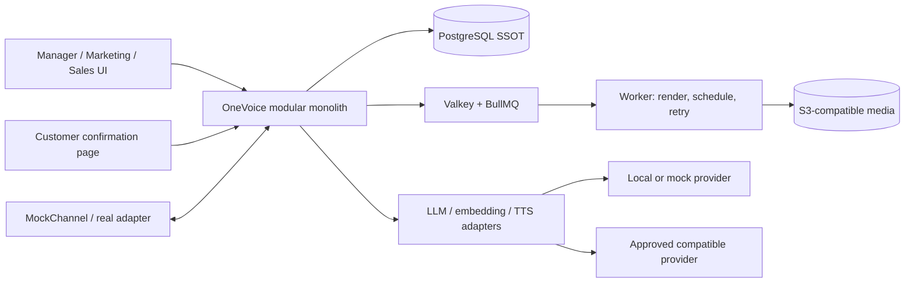

# OneVoice — Blueprint toàn dự án

## 1. Tóm tắt điều hành

**OneVoice là hệ điều hành marketing và bán hàng AI nguồn mở cho doanh nghiệp Việt Nam.**

Hệ thống biến dữ liệu sản phẩm, tồn kho, khuyến mãi và tương tác khách hàng thành một vòng vận hành có kiểm soát:

```text
Dữ liệu → Cơ hội → Chiến dịch → Nội dung → Phê duyệt/Xuất bản
→ Hội thoại → Tư vấn → Đơn nháp → Khách xác nhận → Đơn hàng
→ Đo lường → Cơ hội tiếp theo
```

Bản demo tập trung vào cửa hàng máy tính. OneVoice đọc catalog và dữ liệu vận hành đã được doanh nghiệp phê duyệt; đề xuất sản phẩm cần quảng bá; tạo bài viết hoặc video; kiểm tra facts trước khi đăng; nhận tương tác; tư vấn có bằng chứng; thu thập thông tin giao hàng; tạo đơn nháp; rồi truy vết đơn về nội dung ban đầu.

Giá trị chính không nằm ở “AI viết hay hơn”, mà ở việc nối marketing và bán hàng bằng cùng nguồn dữ liệu, cùng quyền kiểm soát và cùng lịch sử truy vết.

## 2. Bài toán doanh nghiệp

### 2.1 Hiện trạng

Một cửa hàng máy tính thường có nhiều điểm đứt:

- Catalog, cấu hình, giá, tồn kho và khuyến mãi nằm ở các hệ thống hoặc bảng tính khác nhau.
- Nhân viên chọn sản phẩm quảng bá theo cảm tính hoặc khi được nhắc thủ công.
- Công cụ tạo nội dung không biết giá vừa thay đổi hay chương trình đã hết hạn.
- Công cụ đăng bài biết lượt xem nhưng không giữ được ngữ cảnh của cuộc hội thoại và đơn hàng.
- Chatbot có thể trả lời sai facts hoặc không biết khi nào phải chuyển người thật.
- Đơn hàng không lưu nguồn nội dung/campaign đã tạo ra khách.

### 2.2 Khoảng đứt cần giải quyết

> Doanh nghiệp không có một luồng dữ liệu có kiểm soát từ tín hiệu kinh doanh đến đơn hàng và ngược lại.

OneVoice thu hẹp khoảng đứt đó bằng bốn cơ chế nguyên gốc:

1. **Opportunity Engine:** phát hiện cơ hội có lý do và dữ liệu nguồn.
2. **Truth Guard:** chặn claim hoặc hành động dùng facts cũ, thiếu hoặc mâu thuẫn.
3. **Content Passport:** lưu lineage từ snapshot dữ liệu đến nội dung, phê duyệt, tương tác và đơn.
4. **Content-to-Cash Attribution:** nối nguồn theo quy tắc, không tuyên bố quan hệ nhân quả không có bằng chứng.

## 3. Người dùng và quyền quyết định

| Vai trò | Mục tiêu | Được làm | Không được tự làm |
|---|---|---|---|
| Manager | Kiểm soát quy tắc, rủi ro và kết quả | Duyệt/từ chối nội dung, phê duyệt ngoại lệ, xem toàn bộ audit | Sửa/xóa lịch sử bất biến |
| Marketing | Tạo và vận hành chiến dịch | Chọn opportunity, yêu cầu AI tạo nội dung, chỉnh draft | Xuất bản nội dung chưa được duyệt |
| Sales | Tư vấn và xử lý ngoại lệ | Tiếp quản hội thoại, sửa đơn nháp, liên hệ khách | Xác nhận thay khách hoặc tự ghi nhận đã thanh toán |
| Customer | Mua và kiểm soát thông tin của mình | Cung cấp/sửa thông tin, mở link, xác nhận hoặc hủy đơn | Truy cập dữ liệu nội bộ |
| System/AI | Hỗ trợ và tự động hóa có giới hạn | Đề xuất, tạo draft, kiểm tra, trả lời có evidence, yêu cầu handoff | Tự phê duyệt, thương lượng ngoại lệ, xác nhận tiền hoặc xác nhận thay khách |

MVP có ba role nội bộ: `MANAGER`, `MARKETING`, `SALES`. Mọi hành động quan trọng phải lưu actor là người, service hoặc AI run cụ thể.

## 4. Kết quả sản phẩm cần đạt

### 4.1 Kết quả cho doanh nghiệp

- Giảm thao tác chọn sản phẩm và chuẩn bị nội dung nhưng không làm mất quyền phê duyệt.
- Ngăn nội dung hoặc tư vấn dùng giá/khuyến mãi cũ tại thời điểm hành động.
- Phản hồi khách ngoài giờ trong phạm vi facts đã duyệt và chuyển người khi cần.
- Thu thập đủ thông tin để tạo đơn nháp mà không để AI xác nhận thay khách.
- Biết nội dung nào tạo hội thoại, lead và đơn được xác nhận theo quy tắc attribution đã công bố.

### 4.2 Kết quả cho cuộc thi

- Trình diễn đủ H–P–D–I của DX-OS trong một câu chuyện duy nhất.
- Chứng minh phần nguyên gốc của đội bằng code, test và audit trail.
- Kho mã nguồn công khai, mã do đội viết dùng Apache License 2.0, build được từ source và quản lý dependency/model/media minh bạch.
- Có dữ liệu/thử nghiệm được cho phép hoặc ghi nhãn mô phỏng rõ ràng; không tự đặt số liệu thành công.

## 5. Phạm vi chức năng

### 5.1 Yêu cầu P0 — bắt buộc cho vertical slice

| ID | Yêu cầu | Acceptance ở mức sản phẩm |
|---|---|---|
| F-001 | Catalog/SSOT | Import/reset được 10–20 SKU có giá, tồn, specs, ảnh, promotion và version |
| F-002 | Opportunity Engine | Tạo opportunity từ một rule có trigger facts, snapshot, priority và lý do |
| F-003 | Campaign | Tạo campaign từ opportunity hoặc lựa chọn có hướng dẫn |
| F-004 | Content generation | Tạo một post hoặc video artifact chỉ từ facts trong snapshot và mục tiêu đã chọn |
| F-005 | Content Claims | Tách/lưu được các claim quan trọng và evidence tương ứng |
| F-006 | Content Passport | Lưu source hash/version, template/model, người tạo/duyệt, artifact và lineage |
| F-007 | Approval/RBAC | Marketing tạo draft; Manager duyệt; hành động vượt quyền bị từ chối và audit |
| F-008 | Truth Guard | Kiểm tra trước duyệt, xuất bản, trả lời và tạo đơn; stale critical claim phải bị chặn |
| F-009 | Channel/Inbox | MockChannel nhận một interaction gắn được nguồn content/campaign; adapter thật là tùy chọn |
| F-010 | AI consultation | Trả lời kèm SKU/evidence/version; thiếu/mâu thuẫn/ngoài chính sách phải handoff |
| F-011 | Lead capture | Thu thập và validation họ tên, số điện thoại, địa chỉ, giao nhận và consent phù hợp |
| F-012 | Draft order | Tạo đơn nháp với product/version/price/quantity, signed confirmation link và trạng thái |
| F-013 | Customer confirmation | Khách tự kiểm tra, sửa và xác nhận COD; AI không thể set `CONFIRMED` thay khách |
| F-014 | Attribution | Truy vết opportunity→campaign→content→interaction→lead→draft/order theo first-touch |
| F-015 | Audit | Lưu actor, action, target, time, correlation ID và before/after hoặc version reference |
| F-016 | Dashboard/Passport view | Nhìn thấy funnel cơ bản và mở được lineage của đơn demo |

### 5.2 P1 — sau khi P0 ổn định

- Video programmatic dọc từ ảnh sản phẩm, Revideo, phụ đề và TTS tiếng Việt.
- Một adapter Facebook Page, Zalo OA hoặc TikTok Content Posting khi đã có quyền và điều kiện nền tảng.
- Lịch đăng, retry, idempotency và webhook signing production-grade.
- QR/yêu cầu đặt cọc có mã tham chiếu; trạng thái thanh toán do cổng thanh toán hoặc người có quyền xác nhận.
- A/B nội dung và số đo chuyển đổi có định nghĩa rõ.
- Đồng bộ POS/ERP hoặc nguồn tồn kho nội bộ của cửa hàng thử nghiệm.

### 5.3 Không làm trước chung kết trường

- Livestream/avatar AI 24/7.
- AI tự chạy quảng cáo hoặc chi ngân sách.
- Workflow builder tổng quát.
- Microservices, Kafka hoặc Kubernetes.
- Multi-touch/causal attribution.
- CRM, kế toán, logistics, hoàn tiền đầy đủ.
- Agent DevOps tự thực thi lệnh có credential production.

## 6. Quy trình nghiệp vụ chuẩn

### 6.1 Từ dữ liệu đến nội dung

1. Admin/importer đưa catalog đã curate vào SSOT.
2. Cập nhật giá, tồn hoặc promotion tạo version mới; không overwrite lịch sử.
3. Opportunity rule đọc snapshot và tạo cơ hội có lý do.
4. Marketing chọn opportunity hoặc chọn sản phẩm/chương trình thủ công.
5. AI/content template tạo draft và danh sách claims.
6. Evidence validator đối chiếu từng critical claim với snapshot.
7. Content Passport được tạo với source hash, model/template và output hash.
8. Manager xem evidence, duyệt hoặc từ chối.
9. Trước publish, Truth Guard so facts trong Passport với SSOT hiện hành.
10. Nếu SKU/model, giá, tồn hoặc promotion đổi, content chuyển `STALE/BLOCKED` và bắt buộc regenerate/reapprove. Ngoại lệ chỉ dành cho freshness/provenance gap khi Manager xác minh cùng giá trị hiện hành bằng evidence có audit.

### 6.2 Từ tương tác đến đơn hàng

1. Channel adapter chuẩn hóa message/comment thành Interaction và giữ `content_id`, `campaign_id` nếu có.
2. AI xác định nhu cầu, ngân sách và mục đích sử dụng bằng câu hỏi có cấu trúc.
3. Structured lookup chọn facts sản phẩm; RAG chỉ dùng cho policy/mô tả đã duyệt.
4. Câu trả lời lưu Evidence; UI cho nhân viên xem nguồn và thời điểm dữ liệu.
5. Thiếu evidence, mâu thuẫn, yêu cầu giảm giá/ngoại lệ hoặc hành động tài chính tạo `HANDOFF_REQUIRED`.
6. AI thu thập trường cần thiết và consent, rồi tạo Draft Order.
7. Truth Guard kiểm lại giá, tồn, promotion trước khi phát hành link xác nhận.
8. Khách mở signed link, sửa/xác nhận COD hoặc hủy.
9. Order được tạo sau xác nhận; attribution first-touch giữ nguồn ban đầu hoặc `unknown`.
10. Dashboard/Passport hiển thị lineage; dữ liệu kết quả quay lại vòng cơ hội sau.

## 7. Mô hình trạng thái tối thiểu

### Content

```text
DRAFT → VALIDATED → PENDING_APPROVAL → APPROVED → SCHEDULED → PUBLISHED
             └──────────────→ REJECTED
APPROVED/SCHEDULED → STALE → DRAFT (regenerate) → VALIDATED → PENDING_APPROVAL
STALE → EXCEPTION_APPROVED (Manager supplies allowed verification evidence) --TruthCheck(PASS_WITH_EXCEPTION)→ SCHEDULED
APPROVED/SCHEDULED → BLOCKED
```

### Conversation

```text
OPEN_AI → QUALIFYING → READY_FOR_ORDER → CLOSED
OPEN_AI/QUALIFYING/READY_FOR_ORDER → HANDOFF_REQUIRED → HUMAN_ACTIVE → CLOSED
```

### Draft Order/Order

```text
DRAFT → LINK_SENT → CUSTOMER_EDITED → CUSTOMER_CONFIRMED → ORDER_CREATED
   └──────────────→ EXPIRED/CANCELLED
```

`CUSTOMER_CONFIRMED` chỉ được tạo từ hành động hợp lệ trên trang xác nhận của khách, không từ prompt hoặc tool call của AI.

## 8. Kiến trúc logic



Chi tiết module, entity, transaction và công nghệ nằm tại [architecture-and-tech-stack.md](architecture-and-tech-stack.md).

## 9. Ánh xạ DX-OS H–P–D–I

| Không gian | OneVoice thể hiện | Bằng chứng demo |
|---|---|---|
| H — Human | Role, RBAC, approval, customer confirmation, human takeover | Marketing bị chặn publish; Manager duyệt; Sales nhận handoff |
| P — Process | State machine, Truth Guard, outbox/retry, đơn nháp | Nội dung stale bị chặn; workflow chỉ tiếp tục sau hành động hợp lệ |
| D — Data | SSOT, version, snapshot, evidence, audit, lineage | Mở Passport và truy từ order về product snapshot |
| I — Intelligence | Opportunity proposal, content generation, grounded consultation | AI giải thích lý do, trả lời có nguồn và biết dừng |

## 10. Dữ liệu demo và dữ liệu GearVN

Dataset hiện có gồm 4.109 sản phẩm hợp lệ; 3.977 record usable; giá và ảnh đầy đủ; 4.059 có specs. Nó là snapshot ngày 31/08/2026 và chứa lỗi phân loại/chuẩn hóa cùng khuyến mãi đã hết hạn.

Cách sử dụng đúng:

- Chọn 10–20 record `usable`, ưu tiên SKU/spec/ảnh rõ ràng.
- Ghi `source`, `collected_at`, `as_of`, `license_or_permission`, `trust_level`.
- Không dùng `descriptionText` làm nguồn ưu tiên cho facts.
- Bổ sung tồn kho, promotion và policy ở lớp dữ liệu mô phỏng hoặc do cửa hàng xác nhận.
- Dùng promotion hết hạn để demo Truth Guard, nhưng ghi rõ snapshot và không quảng cáo thật.
- Bundle ảnh được phép dùng hoặc asset demo local; không phụ thuộc hotlink khi trình diễn.

Không đưa dữ liệu Long Châu, dữ liệu cá nhân thật hoặc toàn bộ thư mục 1,1 GB vào đường chạy MVP.

## 11. AI có trách nhiệm

AI chỉ được sử dụng ở bốn nơi:

1. Giải thích cơ hội sau khi rule xác định tín hiệu và priority; AI không được tự đổi rule outcome hoặc priority.
2. Sinh nội dung từ snapshot và output schema có cấu trúc.
3. Tư vấn dựa trên facts/policy có Evidence.
4. Phân tích kết quả và đề xuất vòng tiếp theo, không tự xuất bản hoặc chi tiền.

Các invariant:

- Critical facts không được lấy từ trí nhớ model.
- Không có Evidence thì không có claim; thiếu nguồn phải hỏi lại hoặc handoff.
- Prompt của khách không thể cấp quyền hoặc thay đổi policy.
- Tool có side effect kiểm tra RBAC, input schema và idempotency ngoài LLM.
- Không log secret, số điện thoại/địa chỉ đầy đủ hoặc prompt chứa PII vào telemetry.
- Lưu model/provider/version, prompt template hash, input snapshot hash và output hash cho mỗi AI run quan trọng.

## 12. Yêu cầu phi chức năng

| ID | Yêu cầu | Mức nghiệm thu MVP |
|---|---|---|
| NFR-001 | Tái lập | Clone mới dựng được bằng hướng dẫn và một lệnh Compose; seed/reset xác định |
| NFR-002 | Offline demo | Core flow, MockChannel và deterministic AI fixture chạy không cần Internet |
| NFR-003 | An toàn quyền | Deny-by-default cho action nhạy cảm; test vượt quyền và lưu audit |
| NFR-004 | Nhất quán dữ liệu | Critical mutations có transaction, version và outbox; retry idempotent |
| NFR-005 | Riêng tư | Demo dùng PII giả; secret không commit/log; có retention/masking cơ bản |
| NFR-006 | Quan sát | Healthcheck, structured log, correlation ID và audit viewer tối thiểu |
| NFR-007 | Hiệu năng demo | UI core phản hồi ổn định; render/video chạy nền, không khóa request |
| NFR-008 | Khả dụng | Hai lần rehearsal liên tiếp không sửa code; có video và data reset dự phòng |
| NFR-009 | OSS compliance | License OSI cho project; SBOM/dependency/model/media inventory và NOTICE phù hợp |
| NFR-010 | Khả năng thay thế | LLM, TTS, media và channel đi qua adapter; core không khóa vào platform API |

## 13. Bảo mật và quyền riêng tư

- Authentication cho nội bộ; signed, single-purpose, expiring token cho trang xác nhận đơn.
- Authorization kiểm tra ở server, không chỉ ẩn nút trên UI.
- Webhook phải xác minh chữ ký, chống replay và xử lý idempotent khi dùng adapter thật.
- Validate mọi input bằng schema; sanitize content hiển thị; rate-limit endpoint công khai.
- Mã hóa TLS khi chạy ngoài local; secret qua environment/secret store, không nằm trong repo.
- Audit event append-only ở tầng ứng dụng; sửa nghiệp vụ bằng version mới.
- PII demo là dữ liệu giả. Khi thử với người thật phải có thông báo mục đích, tối thiểu hóa trường, retention và khả năng xóa/xuất theo quy trình.
- Không clone giọng nói hoặc dùng hình người nếu chưa có consent và quyền sử dụng có thể chứng minh.

## 14. Chỉ số xác thực

Không đặt mục tiêu “tăng doanh thu X%” khi chưa có thử nghiệm. Đo các chỉ số có thể kiểm chứng:

| Mã | Chỉ số | Cách đo |
|---|---|---|
| M-01 | Thời gian chọn sản phẩm và chuẩn bị campaign | Quay màn hình/ghi thời gian baseline và OneVoice cùng task |
| M-02 | Tỷ lệ critical claim đúng dữ liệu hiện hành | Chạy bộ câu hỏi/claim cố định; lưu expected và evidence |
| M-03 | Tỷ lệ stale/mismatch được Truth Guard phát hiện | Fault injection giá, tồn, promotion; đếm case block đúng |
| M-04 | Tỷ lệ câu hỏi thiếu evidence được handoff đúng | Eval set gồm known, unknown, conflicting, risky |
| M-05 | Tỷ lệ conversation đủ trường tạo Draft Order | Fixture hoặc pilot có consent; validation theo schema |
| M-06 | Tỷ lệ Order có lineage đầy đủ | Query kiểm opportunity→order; nguồn thiếu phải là `unknown` hợp lệ |
| M-07 | Thời gian dựng từ clone mới | Fresh-machine/container rehearsal có log |

## 15. Kịch bản chấp nhận cấp hệ thống

### S-01 — Happy path

Opportunity được tạo từ promotion sắp hết hạn; Marketing tạo draft; Manager duyệt; MockChannel nhận câu hỏi; AI trả lời có Evidence; khách cung cấp thông tin; hệ thống tạo link; khách xác nhận COD; Order truy ngược được về Opportunity.

### S-02 — Dữ liệu cũ

Sau khi content được duyệt, giá hoặc ngày promotion thay đổi. Truth Guard phải chặn publish và chỉ cho tiếp tục sau regenerate/reapprove; đây là nhóm fact không được Manager phê duyệt ngoại lệ.

### S-03 — Thiếu bằng chứng

Khách hỏi một claim không tồn tại hoặc hai nguồn mâu thuẫn. AI không được bịa; Conversation chuyển `HANDOFF_REQUIRED` và Sales thấy lý do/evidence gap.

### S-04 — Vượt quyền

Marketing cố publish chưa duyệt hoặc AI/tool cố xác nhận đơn thay khách. Server từ chối, trạng thái không đổi và AuditEvent được tạo.

### S-05 — Mất dịch vụ ngoài

Ngắt Internet hoặc provider AI/video. Core flow vẫn chạy bằng MockChannel/deterministic fixture; job ngoài retry có giới hạn và UI hiển thị trạng thái thay vì treo.

## 16. Rủi ro cấp dự án

| Rủi ro | Dấu hiệu sớm | Kiểm soát |
|---|---|---|
| Phạm vi quá rộng | Nhiều màn hình nhưng chưa có vertical slice | P0-first, phase gate, feature freeze và cut-line |
| Không có cửa hàng thật | Không có interview/permission trước gate | Dùng synthetic có nhãn; không claim pilot; tiếp tục tìm partner |
| Platform approval chậm | Chưa có app/scopes/webhook test | MockChannel không thể bị loại khỏi MVP |
| AI/video không ổn định | Latency cao, output khó tái lập | Adapter, fixed fixture, template-first, pre-rendered fallback |
| Dữ liệu sai/cũ | Claim dựa trên description/hotlink | Curate, provenance, version, evidence và Truth Guard |
| License không phù hợp | Dependency/model không có license rõ | Default deny, SBOM, inventory bốn luồng, pin revision |
| Demo hỏng | Reset không xác định, phụ thuộc Internet | Seed fixed clock, one-command reset, rehearsal và video dự phòng |

## 17. Ma trận truy vết

| Nhóm yêu cầu | Module/bằng chứng | Tài liệu triển khai | Gate |
|---|---|---|---|
| F-001–F-003 | Catalog version, Opportunity, Campaign | [Kiến trúc](architecture-and-tech-stack.md), [Dữ liệu/AI](data-ai-and-guardrails.md) | P1 |
| F-004–F-008 | Content, claims, Passport, approval, stale block | [Dữ liệu/AI](data-ai-and-guardrails.md), [Kiểm thử](testing-and-quality-plan.md) | P2 |
| F-009–F-013 | Adapter, grounded answer, handoff, Draft Order, confirm | [Kiến trúc](architecture-and-tech-stack.md), [Kiểm thử](testing-and-quality-plan.md) | P3 |
| F-014–F-016 | First-touch lineage, audit, dashboard | [Kiến trúc](architecture-and-tech-stack.md), [Demo](demo-validation-and-scoring.md) | P3/P4 |
| NFR-001–NFR-010 | Compose, mock, security, outbox, observability, SBOM | [DevOps/OSS](devops-release-and-oss-compliance.md) | RC |
| DX-OS H–P–D–I | Role, process, SSOT, AI evidence | [Demo/scoring](demo-validation-and-scoring.md) | Mọi gate |

## 18. Điều kiện hoàn thành dự án

Dự án không hoàn thành chỉ vì video đẹp hoặc tất cả màn hình đã được dựng. Nó hoàn thành ở một mốc khi:

1. Scope của mốc đó có acceptance test và tất cả P0 của mốc đều đạt.
2. Một clone mới dựng được theo README, không cần secret ẩn hoặc thao tác truyền miệng.
3. Vertical slice được chạy xuyên suốt bằng dữ liệu reset được.
4. Truth Guard, Evidence/Handoff, quyền xác nhận của khách và Attribution được chứng minh trực tiếp.
5. Không còn lỗi P0; lỗi chấp nhận để lại có quyết định và workaround rõ.
6. License, dependency, model và asset của release có inventory/SBOM.
7. Demo và video dự phòng đã rehearsal theo đúng thời lượng.
8. Tài liệu và changelog phản ánh đúng trạng thái thực tế, không hứa quá phần đã chạy.

Roadmap tác nghiệp và các phase gate chi tiết nằm tại [development-roadmap.md](development-roadmap.md).
